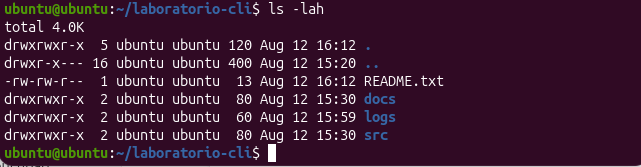

# Laboratorio CLI — Contenido del directorio

## Captura de pantalla

## Información de los archivos y directorios

| Nombre          | Tipo        | Permisos (letras) | Permisos (numérico) | Enlaces | Propietario | Grupo  | Tamaño | Fecha de modificación |
|-----------------|-------------|--------------------|----------------------|---------|-------------|--------|--------|------------------------|
| Laboratorio cli | Directorio  | drwxrwxr-x         | 775                  | 5       | ubuntu      | ubuntu | 120    | Aug 12 16:12           |
| ~ (padre)       | Directorio  | drwxr-x---         | 740                  | 16      | ubuntu      | ubuntu | 400    | Aug 12 15:20           |
| README.txt      | Archivo     | -rw-rw-r--         | 664                  | 1       | ubuntu      | ubuntu | 13     | Aug 12 16:12           |
| docs            | Directorio  | drwxrwxr-x         | 775                  | 2       | ubuntu      | ubuntu | 80     | Aug 12 15:30           |
| logs            | Directorio  | drwxrwxr-x         | 775                  | 2       | ubuntu      | ubuntu | 60     | Aug 12 15:59           |
| src             | Directorio  | drwxrwxr-x         | 775                  | 2       | ubuntu      | ubuntu | 80     | Aug 12 15:30           |
